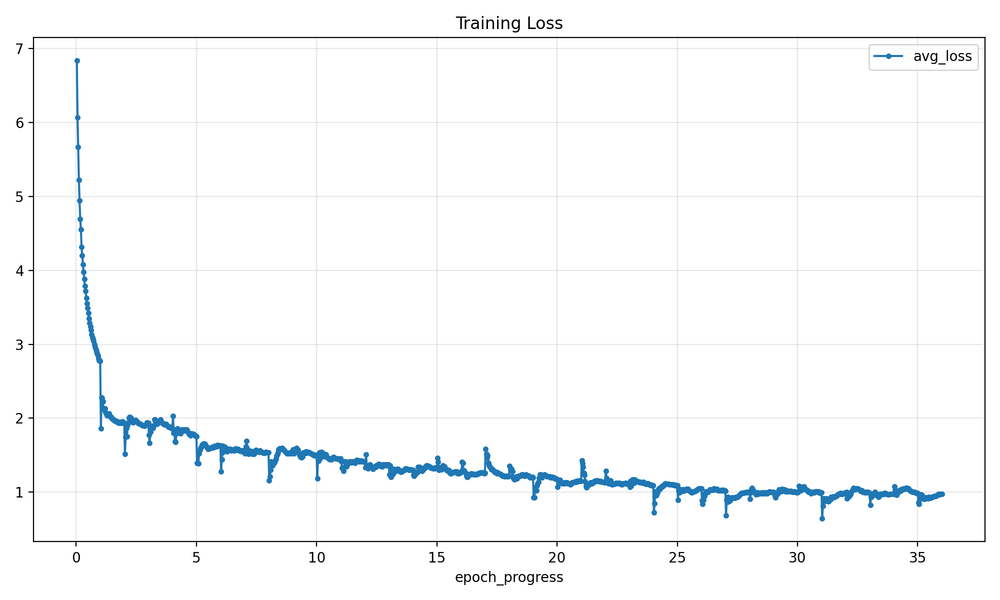

# NYCU Visual Recognition using Deep Learning HW3

**Student ID:** 314554035  
**Name:** 張翊鞍

## Introduction

This repository contains the implementation for NYCU 2026 Spring Visual Recognition using Deep Learning Homework 3: **Instance Segmentation**.

The final solution is based on **Cascade Mask R-CNN** with a **ResNet-50-FPN** backbone. The pipeline converts the original TIFF images and masks into percentile-normalized PNG images and COCO RLE annotations, then trains the model with multi-scale augmentation. During inference, test-time augmentation, low score thresholding, NMS, and mask-derived bounding boxes are used to generate the CodaBench submission file.

## Environment Setup

It is recommended to use Python 3.10 with a clean virtual environment.

```bash
cd HW3

conda create -n hw3 python=3.10 -y
conda activate hw3

pip install -U pip
pip install torch==2.1.2 torchvision==0.16.2 --index-url https://download.pytorch.org/whl/cu121
pip install -r requirements.txt
pip install "numpy<2" --force-reinstall
mim install "mmengine>=0.7.1" "mmcv==2.1.0" "mmdet==3.3.0"
```

If your CUDA version is different, install the matching PyTorch build first, then install the remaining packages with the same commands.

## Dataset Preparation

Download and extract the HW3 dataset:

```bash
python tools/download_data.py
```

Expected raw dataset layout:

```text
HW3/
├── data/
│   ├── train/
│   ├── test_release/
│   └── test_image_name_to_ids.json
└── ...
```

Prepare the final training format:

```bash
python tools/prepare_data.py
```

This command creates:

```text
HW3/
├── data_norm_png_rle/
│   ├── train/
│   ├── val/
│   └── test_release/
├── annotations_norm_png_rle/
│   ├── instances_hw3_train.json
│   ├── instances_hw3_val.json
│   ├── image_info_hw3_test.json
│   └── split_hw3.json
└── ...
```

The script performs p1-p99 percentile normalization, exports 3-channel PNG images, and stores masks as COCO compressed RLE annotations.

## Training

Train the final multi-scale Cascade Mask R-CNN model:

```bash
python train.py configs/final_model.py \
  --exp-name final \
  --amp \
  --log-level WARNING
```

Outputs are saved under:

```text
checkpoints/final/
logs/final/
```

After training, collect logs, epoch summaries, and curves:

```bash
python tools/save_results.py final
```

This creates:

```text
results/final/
├── epoch_summary.csv
├── loss_curve.png
└── val_metrics_curve.png
```

## Inference

Generate the CodaBench submission zip from the final checkpoint:

```bash
python inference.py \
  configs/final_model.py \
  checkpoints/final/epoch_36.pth \
  --test-dir data_norm_png_rle/test_release \
  --mapping annotations_norm_png_rle/image_info_hw3_test.json \
  --exp-name final \
  --result-name final_submission \
  --tta \
  --score-thr 0.0 \
  --tta-nms-iou 0.5 \
  --bbox-from-mask
```

The output files will be:

```text
results/final/final_submission.json
results/final/final_submission.zip
```

The JSON file inside the zip is automatically named `test-results.json`, which matches the CodaBench submission requirement.

## Confusion Matrix

If a trained checkpoint is available, run validation inference and then plot the mask-IoU confusion matrix:

```bash
python inference.py \
  configs/final_model.py \
  checkpoints/final/epoch_36.pth \
  --test-dir data_norm_png_rle/val \
  --mapping annotations_norm_png_rle/instances_hw3_val.json \
  --exp-name final \
  --result-name val_final \
  --score-thr 0.0 \
  --bbox-from-mask

python tools/make_confusion_matrix.py \
  annotations_norm_png_rle/instances_hw3_val.json \
  results/final/val_final.json \
  --out-dir results/final \
  --score-thr 0.0
```

The generated files will be:

```text
results/final/confusion_matrix.csv
results/final/confusion_matrix.png
```

## Performance Snapshot

Training loss curve:



Confusion matrix:

Reserved. The figure will be added after regenerating validation predictions with the final checkpoint.

CodaBench ranking:

Reserved. The figure will be added after the final CodaBench submission is completed.

## References

This implementation is built with MMDetection and uses Cascade Mask R-CNN with COCO-pretrained weights.

- [MMDetection](https://github.com/open-mmlab/mmdetection)
- [Cascade R-CNN](https://arxiv.org/abs/1712.00726)
- [Mask R-CNN](https://arxiv.org/abs/1703.06870)
