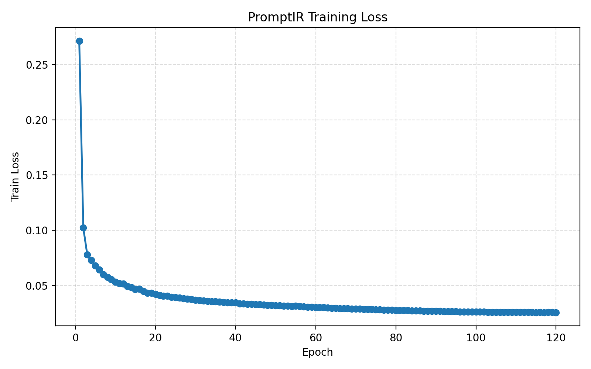
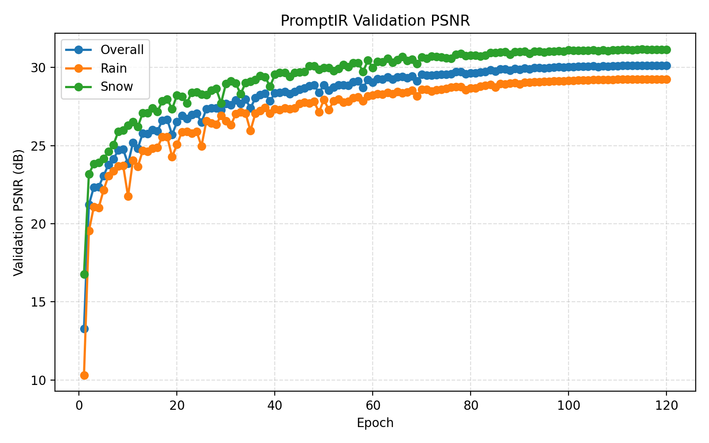

# NYCU Visual Recognition using Deep Learning HW4

**Student ID:** 314554035  
**Name:** 張翊鞍

## Introduction

This repository contains the implementation for NYCU 2026 Spring Visual Recognition using Deep Learning Homework 4: **Image Restoration**.

The final solution is based on **PromptIR**, a prompt-based all-in-one blind image restoration model. The model is trained from scratch on the provided rain/snow paired dataset without pretrained weights or external data. Since validation analysis showed that rain images were the main bottleneck, the final training setting uses **2x rain oversampling** and a small **directional gradient loss** in addition to the original L1 reconstruction loss.

The directional gradient loss is designed to penalize residual streak-like artifacts. For mostly vertical rain streaks, the x-direction gradient is weighted more heavily because it captures the left/right edge changes produced by thin vertical rain lines.

## Environment Setup

It is recommended to use a clean virtual environment.

```bash
cd HW4

python -m venv .venv
source .venv/bin/activate

pip install -r requirements.txt
```

## Dataset Preparation

Download and extract the HW4 dataset:

```bash
python -m pip install gdown
gdown 1bEIU9TZVQa-AF_z6JkOKaGp4wYGnqQ8w -O hw4_realse_dataset.zip
unzip hw4_realse_dataset.zip
```

Expected dataset layout:

```text
HW4/
├── hw4_realse_dataset/
│   ├── train/
│   │   ├── degraded/
│   │   └── clean/
│   └── test/
│       └── degraded/
└── ...
```

## Training

Train the final PromptIR model with rain oversampling and directional gradient loss:

```bash
python train.py \
  --dataset-root hw4_realse_dataset \
  --output-dir runs/promptir_rain_over_grad \
  --epochs 120 \
  --batch-size 4 \
  --patch-size 128 \
  --num-workers 4 \
  --device cuda \
  --loss-type l1 \
  --rain-oversample 2 \
  --grad-weight 0.05 \
  --grad-x-weight 2.0 \
  --grad-y-weight 1.0
```

Outputs are saved under:

```text
runs/promptir_rain_over_grad/
├── latest.pt
├── best_psnr.pt
├── best_loss.pt
├── metrics.csv
├── loss_curve.png
└── psnr_curve.png
```

`best_psnr.pt` is selected by the highest overall validation PSNR. The validation log also reports rain and snow PSNR separately.

## Inference

Generate the CodaBench submission file from the final checkpoint:

```bash
python infer.py \
  --dataset-root hw4_realse_dataset \
  --checkpoint runs/promptir_rain_over_grad/best_psnr.pt \
  --output pred.npz \
  --device cuda
```

If inference runs out of memory, use tiled inference:

```bash
python infer.py \
  --dataset-root hw4_realse_dataset \
  --checkpoint runs/promptir_rain_over_grad/best_psnr.pt \
  --output pred.npz \
  --device cuda \
  --tile-size 256 \
  --tile-overlap 32
```

The output file `pred.npz` follows the CodaBench submission format: each key is the original test filename, and each value is a restored `uint8` image array with shape `(3, H, W)`.

## Performance Snapshot

Best validation result of the final experiment:

| Setting | Best Epoch | Val PSNR | Rain PSNR | Snow PSNR |
|---|---:|---:|---:|---:|
| Rain oversampling + gradient loss | 116 | 30.1299 | 29.2567 | 31.1575 |

Training loss curve:



Validation PSNR curve:



This task is image restoration rather than classification, so a confusion matrix is not applicable.

## References

This implementation is adapted from PromptIR and modified for the HW4 rain/snow restoration task.

- [PromptIR: Prompting for All-in-One Blind Image Restoration](https://arxiv.org/abs/2306.13090)
- [Official PromptIR GitHub repository](https://github.com/va1shn9v/PromptIR)
